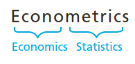
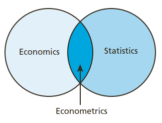

```{r setup, echo = F}
knitr::opts_chunk$set(
  comment = "#",
  #cache = TRUE,
  collapse = TRUE,
  warning = FALSE,
  message = FALSE,
  fig.width = 7,
  fig.height = 5.25,
  fig.align = 'center',
  fig.retina = 3
)

# base plot layout
mypar = list(mar = c(3,3,0.5,0.5), mgp = c(1.5, 0.3, 0), tck = -.008)

# xaringan Extra
xaringanExtra::use_xaringan_extra(c("tile_view", "animate_css", "tachyons"))
xaringanExtra::use_extra_styles(
  hover_code_line = TRUE,         #<<
  mute_unhighlighted_code = TRUE  #<<
)
xaringanExtra::use_editable(expires = 1)
xaringanExtra::use_panelset()
xaringanExtra::use_scribble()

```


class: middle, title-slide

<!-- top logo (comment to remove or edit on `conf/css/style.css:23`) -->
<div class="lab-logo"></div>
<!-- <div class="uni-logo"></div> -->

# Pendahuluan

<hr width="100%" align="left" size="1.3" color="gold"></hr>

## <span style="color:gold">Ekonometrika Sesi 1</span>

### Tedy Herlambang .small[<br> ]

<br><br><br><br><br>
[<i class="fas fa-blog" style="color:#e7e8e2"></i> bangtedy](https://bangtedy.github.io)

[<i class="fa fa-twitter fa-lg" style="color:#e7e8e2"></i> @t_hlb](https://twitter.com/t_hlb)

---

# Capaian Pembelajaran
Setelah mempelajari modul ini Anda diharapkan mampu:
- Menjelaskan definisi dan ruang lingkup ekonometrika serta distribusi probabilitas yang digunakan dalam uji statistika

Secara khusus Anda diharapkan mampu:

1. Menjelaskan definisi dan tujuan ekonometrika
2. Langkah-langkah dalam riset ekonomi dengan menggunakan ekonometrika
3. Merumuskan model-model ekonometrika untuk riset ekonomi
4. Menjelaskan dasar-dasar statistika yang digunakan untuk riset dengan ekonometrika

---
# KB1: Teori Ekonomi dan Ekonometrika

> Penyederhanaan perilaku manusia yang sangat kompleks, tetapi
mampu menjelaskan dengan baik perilaku manusia

---

# Teori Ekonomi dan Ekonometrika

- Teori ekonomi mungkin mengatakan bahwa terdapat hubungan antara dua variabel atau lebih (misal harga barang dengan jumlah permintaannya), 
  + Ekonomi terapan menghendaki bukti bahwa hubungan ini nyata sekaligus bisa diamati di kehidupan sehari-hari, serta kuantifikasi hubungan antara variabel tersebut.
- The study of the methods that enable us to quantify economic relationships using actual data is known as *econometrics* (ekonometrika).

---

class: middle, center


```{r out.width = '21%', fig.align='center', echo=FALSE}

```

```{r out.width = '41%', fig.align='center', echo=FALSE}

```
---
# Metodologi Ekonometrika
1. Teori Ekonomi (misal teori Permintaan)
2. Model Matematika (Hukum Permintaan)
3. Model Ekonometrika (Hukum Permintaan)
4. Pengumpulan Data
5. Estimasi
6. Uji Model
7. Prediksi dan Kebijakan
---
# Program Komputer
- Eviews, GAUSS, Limdep, Matlab, Minitab, SPSS, Stata,  --> berbayar, support resmi dari pabrikan
- R (open source) --> gratis, tutorial banyak tersedia di internet
- Mempermudah penghitungan

---
# Pertanyaan:
.font150[Mengapa hubungan antara variable di dalam model ekonometrika bersifat statistik bukan matematis?]

---

# KB 2: Dasar-Dasar Statistika

.font150[There are three kinds of lies: lies, damned lies and statistics] — 
variously attributed to Benjamin Disraeli, Mark Twain etc.

---
# Kasus 1: simulasi data yang terdistribusi normal, t, Chi-square, F
- Dengan bantuan program komputer ini sangat mudah dilakukan
    + (juga untuk membuat data riset abal-abal)
- Di dalam praktek data riset yang kita peroleh seringkali tidak "mulus" seperti di dalam teori.

```{r eval=TRUE}
set.seed(12345)
x <- rnorm(50)
mean(x)
median(x)
var(x)
sd(x)
```
---
```{r eval=TRUE}
quantile(x)
```

```{r  eval=TRUE}
par(mfrow=c(1,2))
hist(x)
curve(dnorm(x), from=-4, to=4)

```
---
# Kasus 2: [CPS1985](https://rdrr.io/cran/AER/man/CPS1985.html)
Deskripsi data:
- Data *cross-section* dari survei populasi Mei 1985 oleh badan statistik AS.
- Data frame terdiri dari 534 pengamatan pada 11 variabel:
    + wage (in dollars per hour).
    + education (Number of years of education).
    + experience (Number of years of potential work experience (age - education - 6)).
    + age (Age in years).
    + ethnicity (Factor with levels "cauc", "hispanic", "other").
    + region (Factor. Does the individual live in the South?)

---
#### Lanjutan ...
- Data frame terdiri dari 534 pengamatan pada 11 variabel
    + gender (Factor indicating gender.
    + occupation (Factor with levels "worker" (assembly line worker), "technical" (technical worker), "services" (service worker), "office" (office and clerical worker), "sales" (sales worker), "management" (management and administration).
    + sector (Factor with levels "manufacturing" (manufacturing), "construction", "other").
    + union (Factor. Does the individual work on a union job?)
    + married (Factor. Is the individual married?)
    
---

# Data bisa dipanggil dari AER package:
```{r eval=requireNamespace("AER", quietly=TRUE)}
library(AER)
data(CPS1985)
attach(CPS1985)
str(CPS1985)
```

```{r eval=requireNamespace("AER", quietly=TRUE)}
head(CPS1985)
```
---
```{r eval=requireNamespace("AER", quietly=TRUE)}
mean(wage)
var(wage)
sd(wage)
summary(wage)
```
---
```{r eval=requireNamespace("AER", quietly=TRUE)}
par(mfrow=c(1,2))
hist(wage, freq = FALSE)
hist(log(wage), freq = FALSE)
lines(density(log(wage)), col = 4)
```
---
```{r eval=requireNamespace("AER", quietly=TRUE)}
summary(occupation)
pekerjaan <- table(occupation)
prop.table(pekerjaan)
```
---
```{r eval=requireNamespace("AER", quietly=TRUE)}
par(mfrow=c(1,2))
barplot(pekerjaan)
pie(pekerjaan)
```
---
```{r eval=requireNamespace("AER", quietly=TRUE), echo=FALSE}
xtabs(~ gender + occupation, data = CPS1985)
par(mfrow=c(1,1))
plot(gender ~ occupation, data = CPS1985)
```
---
class: inverse, right, bottom


# Kso'on, find me at...
<hr width="45%" align="right" size="0.3" color="orange"></hr>

[<i class="fa fa-twitter fa-lg" style="color:#99052f"></i> <span style="color:#fc911e"> @t_hlb </span>](https://twitter.com/t_hlb)
[<i class="fas fa-blog" style="color:#fc911e"></i><span style="color:#99052f"> bangtedy.github.io</span>](https://bangtedy.github.io)